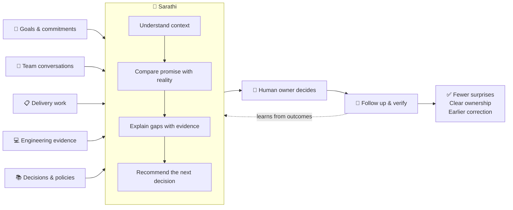

# Sarathi

> 🧭 An open-source AI Delivery Assistant that helps software organizations keep promises, priorities, people, and delivery evidence aligned.

Software delivery rarely goes off track because teams lack another task tracker. It goes off track because the real picture is spread across meetings, chat, Jira, code, documents, and people's memory.

Important messages are forgotten. Commitments lose owners. Priorities change without being renegotiated. "Done" lacks evidence. Leaders and clients discover the drift after it has become expensive.

Sarathi helps teams see that gap earlier and turn it into a clear human decision.

## 🎯 Purpose

Sarathi gives a delivery leader a continuously updated view of:

- what the organization said it would achieve;
- what teams and individuals committed to do;
- what is actually happening across delivery systems;
- where evidence, ownership, or follow-through is missing;
- which decisions need clarification, renegotiation, or escalation.

It works alongside the tools a team already uses. It does not replace Jira, Microsoft Teams, GitHub, project managers, or engineering leaders.

## 😓 The Problem It Solves

Sarathi is intended for organizations experiencing patterns such as:

- leaders repeatedly asking for the same status;
- important Teams messages being ignored or forgotten;
- Jira and actual delivery telling different stories;
- client commitments disappearing into conversations;
- projects consuming attention without a clear link to business goals;
- blockers and quality gaps surfacing late;
- delivery managers spending most of their time chasing updates;
- confident progress claims that cannot be supported with evidence.

These are not merely reporting problems. They are coordination and accountability problems.

## 🤝 How Sarathi Collaborates

Sarathi follows a simple operating loop:

1. **Listen:** understand approved context from the systems where work happens.
2. **Compare:** identify gaps between agreed intent and observed delivery.
3. **Explain:** show the evidence and distinguish facts from inference.
4. **Ask:** put a clear choice in front of the responsible human.
5. **Follow through:** remind, record the response, and verify the outcome.

Sarathi proposes and remembers. Humans decide. Existing work systems retain their authority.

## 💼 Value For The Organization

### For executives and business owners

- See whether delivery attention matches business priorities.
- Discover silent strategic changes before they become client surprises.
- Separate genuine progress from unsupported confidence.
- Make capacity and course-correction decisions with better evidence.

### For delivery managers

- Spend less time reconstructing status and chasing routine updates.
- Turn scattered conversations into explicit commitments and decisions.
- Produce delivery reviews and stakeholder updates from the same evidence.
- Escalate silence, blockers, and missing evidence consistently.

### For delivery teams

- Receive clearer asks with context and response choices.
- Find project decisions and delivery expectations without interrupting the PM.
- Correct misunderstandings before they become permanent records.
- Avoid repeating status in multiple places.

## ✨ What Sarathi Is Designed To Support

- Evidence-linked answers inside Microsoft Teams.
- Delivery health and alignment reviews over existing work signals.
- Goal, commitment, decision, risk, and dependency tracking.
- Follow-up and accountability workflows for accepted actions.
- Operational and compliance reminders.
- Daily delivery briefs and weekly drift reviews.
- Human-approved stakeholder and leadership updates.
- Isolated workspaces for different projects, products, clients, or operating units.

Capabilities are enabled per workspace. Sensitive Finance, leadership, client, and team context remain separated by policy.

## 🔐 Human Control And Trust

Sarathi is designed to be a work partner, not a hidden employee-scoring system or autonomous manager.

- Inferred goals or commitments remain proposals until an authorized person accepts them.
- Important answers should link back to their evidence.
- Sensitive information is filtered before it is retrieved or sent to an AI model.
- Silence and missed commitments can be recorded without endlessly nagging people.
- Teams can correct, reject, renegotiate, reassign, or escalate an action.
- Each organization controls where Sarathi runs and what it may access.

## 🌍 Why Open Source

Sarathi touches an organization's goals, conversations, delivery evidence, and operating memory. Leaders and teams should be able to inspect the system influencing those decisions.

Open source allows an organization to:

- self-host its delivery intelligence;
- inspect and change its policies;
- keep private work data inside its chosen environment;
- understand how recommendations and actions are produced;
- contribute reusable delivery practices without publishing confidential context;
- avoid placing a critical operating relationship behind an opaque vendor service.

The public repository contains the reusable product. Each organization keeps its real workspace mappings, policies, recipients, and sensitive context in a private configuration repository or approved private store.

## 🚀 Activate Sarathi In Your Organization

Sarathi is currently best introduced as a controlled internal pilot rather than a company-wide rollout.

1. Choose one delivery problem and one accountable sponsor.
2. Select a bounded pilot workspace, such as one project or operating team.
3. Connect only the approved Teams, Jira, GitHub, and documentation sources.
4. Run Sarathi in observation or shadow mode and review its findings privately.
5. Install the Teams app and prove one real, evidence-linked workflow.
6. Expand capabilities only after the team accepts the value and boundaries.

The technical operator and Microsoft 365 administrator should follow the [Organization Installation And Activation Guide](docs/installation.md).

## 🏗️ Current Maturity

Sarathi is under active development. The repository contains working foundations for Teams-based questions, delivery evidence, workspace intent, reports, reminders, and hosted operation. It is not yet a one-click enterprise installation.

Production use should be treated capability by capability. A successful deployment is not the same as a useful or trusted organizational rollout. Start small, verify the evidence boundaries, measure whether it reduces coordination work, and keep a manual override.

## 📚 Learn More

- [Product purpose and boundaries](docs/product/what.md)
- [Why Sarathi exists](docs/product/why.md)
- [How Sarathi works](docs/product/how.md)
- [Organization installation and activation](docs/installation.md)
- [Documentation index](docs/README.md)

## 💬 Feedback

We are especially interested in feedback from delivery managers, engineering leaders, software services firms, and organizations running Microsoft Teams:

- Which coordination failures cost you the most time or client trust?
- Which decisions should an assistant prepare but never make?
- What evidence would make you trust a delivery warning?
- What would your security or leadership team require before adoption?

## License

Sarathi is licensed under the [Apache License 2.0](LICENSE).
