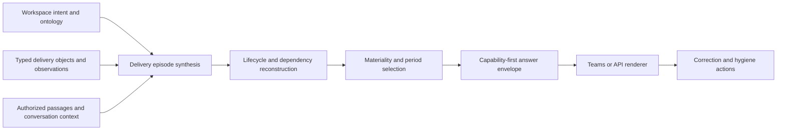

# Delivery Synthesis Architecture

This document defines the implementation architecture for converting authorized project activity into capability-first recent-delivery answers without binding product meaning to one source system.

## Capability Boundary

The `delivery-intelligence` bounded context owns delivery meaning:

- governed initiatives and capabilities;
- delivery episodes;
- lifecycle state and transitions;
- human and operational dependencies;
- source disagreements and unaccounted work;
- query products and answer envelopes.

The `knowledge-layer` owns versioned documents, passages, source references, full-text and vector retrieval, checkpoints, and deletion reconciliation. It supports delivery intelligence but does not decide capability, materiality, delivery state, or answer structure.

Messaging adapters own Microsoft Teams transport and rendering constraints. Source adapters own provider pagination, throttling, normalization, and change notifications. Neither owns product semantics.

## Processing Flow

The pipeline preserves two distinct products:

- an internal, source-linked operating representation used for reconciliation and correction;
- a concise user-facing narrative organized by capabilities, delivery state, and next action.

Internal provenance must not leak into repetitive user-visible boilerplate.

This is the current report path for weekly, sprint, recent-period, and leadership products. Structured delivery selection establishes the authorized population and completeness boundary. Report prose is model-composed from that accepted envelope. Recent-period composition commonly occupies roughly 40–60 seconds; this is an operating expectation, not a universal latency SLA.

## Workspace Ontology

A workspace pack should declare or synchronize:

- initiatives, goals, commitments, and capability names;
- aliases and stable identifiers;
- relevant brands, products, modules, repositories, environments, and teams;
- explicit relationships among initiatives, capabilities, projects, and source entities;
- source authority roles and freshness expectations;
- permitted output audiences and action classes.

Alias matching is only one signal. Resolution may also use declared repository ownership, Jira hierarchy, module paths, linked documents, actor context, and previously ratified episode mappings.

Unresolved material activity remains an explicit `unaccounted` classification. It must not be silently discarded merely because it lacks an alias match.

## Source Participation

Each source adapter emits normalized records and references into the shared workspace boundary.

### Planning and strategy sources

These provide broad intent, capability vocabulary, priority, period, and delivery promises. They seed or update candidate intent but do not automatically prove current execution state.

### Execution trackers

Jira-like systems provide work-item identity, intended ownership, workflow state, sprint or release placement, and acceptance fields. Their records may be stale and are compared with newer source activity.

### Conversation sources

Teams standard channels, explicitly mapped meeting or group chats, and bounded email provide decisions, clarifications, requirements, approvals, handoffs, and waiting states.

Source participation is not an answering-capability claim. The runtime can index an explicitly mapped meeting or group chat while still denying inbound questions from that chat. Current inbound Teams answering uses the standard-channel resolver with explicit channel and actor mappings; private/shared-channel and chat answering require separate resolution, authorization, delivery, and acceptance evidence.

Conversation ingestion should preserve:

- message identity and timestamps;
- author identity after workspace mapping;
- reply and quoted-message context;
- bounded adjacent-message windows;
- channel or chat scope;
- deletion and edit reconciliation;
- bot/system-noise exclusions;
- provider pagination and retry behavior.

Conversation messages are inputs to episodes, not report rows.

### Repositories and delivery systems

Repositories, CI, and deployment systems provide implementation, integration, checks, releases, and environment transitions. They help distinguish code completion from production and acceptance.

### Documentation sources

Vault and project documentation provide architecture, requirements, QA checklists, demos, decisions, and durable project context. Retrieved passages enrich an episode when typed records are insufficient.

## Delivery Episode Model

A delivery episode is a workspace-scoped aggregate representing one meaningful change or coordination thread.

Its logical fields include:

- stable episode identity;
- initiative and capability links;
- title and concise narrative;
- materiality and period membership;
- lifecycle state and transition history;
- owners, contributors, and affected entities;
- decisions and requirement changes;
- technical and human dependencies;
- source references and attributed claims;
- conflict and correction state;
- compact follow-up links.

Episode identity must support cross-source consolidation. A Jira issue, related pull requests, deployment messages, and QA conversation may describe one episode even though their source-native keys differ.

## Lifecycle Reconstruction

The reusable lifecycle is:

`scoped → implementing → development-ready → QA → production → accepted`

The state reducer considers typed source observations and attributed claims. It should:

- keep the latest defensible state rather than all progress chatter;
- preserve earlier transitions for period questions;
- distinguish deployment from validation and acceptance;
- represent rework or regression without creating a second unrelated delivery;
- expose conflicting active states for review;
- avoid treating source update time as completion time when a source-native transition exists.

Workspace-specific labels map into these stable states instead of creating product-specific renderers.

## Dependency Intelligence

Dependencies are typed relations or active claims with temporal state. Supported categories include:

- human response or handoff;
- approval or client confirmation;
- QA or re-QA;
- access, credential, or environment availability;
- repository, service, or deployment order;
- requirement or design clarification;
- external system or vendor dependency.

The query model should support `waiting actor`, `awaited party`, `since`, `requested action`, `affected episode`, and `current status`.

Dependency intelligence must describe coordination, not score individual productivity.

## Query Products

Recent-period questions compile into a reusable product profile with:

- period interpretation;
- requested completion threshold;
- initiative, capability, entity, and audience scope;
- required delivery sections;
- permitted sources;
- detail and link budget;
- rendering surface.

The same model supports yesterday, this week, last week, last 30 days, current blockers, and who-is-waiting-for-whom queries. A new wording should not require a bespoke adapter or datastore projection.

## Enrichment And Composition

Typed census selection supplies candidate episodes. Broader answers then use bounded enrichment:

1. exact source and entity references;
2. typed relation traversal;
3. full-text retrieval;
4. authorized vector retrieval;
5. optional live-source refresh when the configured source role requires it.

The model composer receives a bounded episode envelope containing meaningful source prose, decisions, state, and dependencies. Weekly, sprint, monthly, quarterly, and leadership reports have no deterministic publication fallback. Provider failure, timeout, malformed output, invalid citations, or failed quality validation returns only the privacy-safe report-composition failure notice; the underlying envelope is never posted.

## Answer Envelope

The default envelope contains:

- delivered capability groups;
- in-progress capability groups;
- active waits and blockers;
- decisions or corrections needed;
- compact source links;
- private internal diagnostics excluded from normal rendering.

Sprint Review and Outlook extends this envelope with reconstructed previous-sprint membership at sprint start, mid-sprint additions, completion, rollover and dropped work; current sprint identity, dates, ownership and lifecycle; and exact governed initiative identities with explainable health. It remains a projection of the same episodes rather than a separate report service.

Materiality, capability order, and decision urgency control presentation. Alias coverage, source order, or provider pagination order must not become ranking criteria.

## Jira Hygiene Loop

Execution-plan hygiene is a derived product over episodes and source conflicts. It identifies candidate actions such as:

- create a missing work item;
- update state or ownership;
- add acceptance criteria or a dependency;
- archive stale work;
- connect unaccounted activity to an initiative;
- reconcile a source conflict.

Initial behavior is read-only recommendation. Mutations require an enabled action capability, explicit workspace policy, normal provider authorization, and a correction trail.

## Public And Private Boundary

The public repository owns this architecture, generic domain contracts, adapters, rendering rules, tests, and synthetic examples.

Private overlays own organization-specific initiatives, capability aliases, source identifiers, actor mappings, repository scopes, planning artifacts, operating roles, and acceptance criteria. Secrets and raw source bodies remain outside Git.

## Fitness Expectations

Reusable tests should verify:

- one delivery episode consolidates related cross-source activity;
- implementation, QA, production, and acceptance remain distinct;
- quoted conversation context survives normalization;
- system/bot noise can be excluded before passage creation;
- shared source budgets fail closed and report partial coverage;
- material unaccounted work remains visible;
- dependency state includes owner, awaited party, since, and next action;
- rendering groups by capability and moves source links after the narrative;
- private workspace identifiers cannot enter public fixtures or docs;
- the same query grammar supports 24-hour, 7-day, and 30-day products.

These are durable fitness expectations. The current implementation includes structured cross-source reporting and strict composed-or-safe-failure publication, while channel-specific availability and live acceptance must still be established independently through the readiness model.
