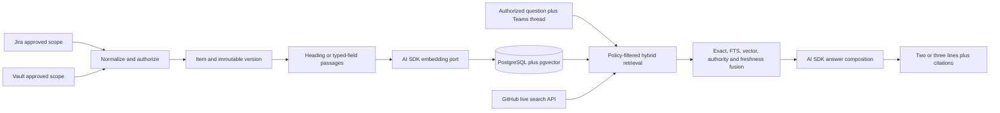

# Feature Specification: example Knowledge Layer

**Feature Branch**: `feat/knowledge-layer`
**Created**: 2026-07-20
**Status**: Approved for implementation
**Parent Specification**: [Teams Mention Production](../002-teams-mention-production/spec.md)
**Execution State**: private delivery tracker

## 1. Purpose

Extend the accepted example production pilot with a durable, policy-bounded knowledge capability. Sarathi indexes approved Jira and example Vault evidence, retrieves GitHub evidence live, combines those sources with the already approved Teams thread context, and returns a normally two- or three-line answer with resolvable citations.

This is a child capability of the existing production pilot. It is not a new product plan, runtime, workspace, epic, or convoy.

## 2. Problem and Objective

The current production path proves bounded retrieval with narrow exemplars. It does not provide enough example coverage for real delivery questions, durable source synchronization, semantic retrieval, source edits and deletions, or coherent ranking across indexed and live sources.

The objective is to answer real example delivery and implementation questions from authorized evidence while preserving workspace, audience, ACL, sensitivity, source authority, version, provenance, and deletion boundaries before any evidence reaches a model.

## 3. Principles

1. **Authorization precedes content access.** Candidate metadata is filtered before passage bodies are loaded, composed, logged, or sent to a model.
2. **Sources retain authority.** Jira and Vault remain canonical; PostgreSQL stores retrieval projections and checkpoints. GitHub remains a live retrieval backend.
3. **Versions and deletions are first-class.** Every indexed body belongs to an immutable source version; reconciliation retires superseded or deleted passages deterministically.
4. **Hybrid evidence beats a single score.** Exact identifiers, PostgreSQL full-text search, vector similarity, source authority, freshness, and reciprocal-rank fusion contribute independently and remain inspectable.
5. **Provider and framework code stay at the edge.** Domain and application code depend on ports, not Drizzle, PostgreSQL, pgvector, Jira, GitHub, Vault, Teams, or AI SDK types.
6. **Concise answers remain auditable.** Normal answers use two or three lines and compact resolvable citations; unavailable or stale sources are stated without leaking restricted content.

## 4. Capability Architecture

The `knowledge-layer` bounded context owns canonical evidence vocabulary, ingestion and reconciliation rules, authorization-aware retrieval, result fusion, and cited-answer contracts. Infrastructure adapters own source APIs, filesystem access, Drizzle/PostgreSQL, pgvector, and model/embedding providers. Teams mention composition imports the capability only through its public module surface.

## 5. User Scenarios and Acceptance

### Story 1 — Delivery Status and Risk Answers (P0)

A mapped example participant asks about delivery status, approved risks, or next action and receives a concise synthesis from current authorized Jira, Vault, and Teams evidence.

**Independent test**: the two required delivery questions return two or three lines with at least one resolvable Jira or Vault citation, no duplicate facts, and no evidence above the caller's boundary.

### Story 2 — Implementation Answer With Live GitHub Evidence (P0)

A mapped participant asks an implementation question that cannot be answered from Jira or Vault alone. Sarathi queries the approved GitHub repositories live and cites the exact repository resource instead of storing a codebase copy.

**Independent test**: a controlled implementation question produces a resolvable GitHub citation and the database contains no duplicated repository body or embedding.

### Story 3 — Source Change and Deletion Reconciliation (P0)

An approved Jira issue or Vault document changes, moves out of scope, loses permission, or is deleted. The next bounded sync creates the new version or tombstone and makes stale passages unretrievable.

**Independent test**: edit, delete, ACL-revoke, and replay fixtures prove version history, deduplication, checkpoint advancement, and immediate retrieval exclusion.

### Edge Cases

- Exact Jira keys and repository identifiers outrank semantically similar prose.
- A source item may be visible while one comment or Vault section is restricted; passage-level ACL is the effective boundary.
- Embedding or GitHub outages produce an explicit partial answer only when remaining authorized evidence is sufficient; authorization and workspace failures fail closed.
- A citation without an approved resolvable URL is not eligible for answer composition.
- Repeated ingestion of the same version changes neither active passage count nor checksum.

## 6. Functional Requirements

- **FR-001**: Model canonical `source -> item -> version -> passage -> retrieval projection`, plus ACL bindings and source checkpoints, in PostgreSQL.
- **FR-002**: Use Drizzle ORM schema definitions and versioned Drizzle migrations for new production tables; retain existing audit tables and incrementally coexist with unapplied legacy Strategy Kernel definitions.
- **FR-003**: Install and verify the `vector` extension in the existing Railway PostgreSQL service through the versioned migration path.
- **FR-004**: Normalize approved Jira issues from typed fields, description, and approved comments while preserving keys, URLs, field/comment identity, versions, timestamps, authorship where allowed, authority, ACL, and provenance.
- **FR-005**: Normalize approved example Vault documents primarily by Markdown headings while preserving path, heading anchor, content hash, source version, sensitivity, ACL, and resolvable Vault citation metadata.
- **FR-006**: Query approved GitHub repositories live through GitHub search/API with repository, path, symbol or line context, current revision metadata, and resolvable URLs; do not persist repository bodies or embeddings.
- **FR-007**: Provide an AI SDK embedding port with configured model and dimension validation plus a deterministic, non-semantic test implementation.
- **FR-008**: Retrieve by exact identifiers, PostgreSQL full-text search, and vector similarity with workspace, audience, ACL, sensitivity, source, active-version, and deletion filters applied before bodies reach application or model code.
- **FR-009**: Fuse per-backend ranks with reciprocal-rank fusion using configurable defaults `top-k=10` and `rrf-k=60`, then apply explicit source-authority and freshness signals without allowing them to bypass authorization.
- **FR-010**: Suppress duplicate passages and duplicate facts using stable source identity, content hashes, active versions, and deterministic fusion keys.
- **FR-011**: Compose normally two- or three-line answers that distinguish fact from inference, cite every material claim, and expose only approved resolvable links.
- **FR-012**: Provide durable `knowledge ingest`, `knowledge reconcile`, `knowledge query`, and `knowledge status` CLI operations with safe JSON summaries containing counts, checksums, checkpoint IDs, and no private bodies.
- **FR-013**: Reconcile edits, deletions, scope removal, and ACL changes so inactive or unauthorized passages are excluded before model egress.
- **FR-014**: Preserve current Z.AI primary and OpenRouter fallback model ordering through Vercel AI SDK provider abstractions; never log provider credentials.
- **FR-015**: Index only explicitly approved Jira and Vault scopes. This slice excludes email, broad private Teams history, cross-workspace synthesis, and full codebase indexing.

## 7. Key Entities and Data Contracts

- **KnowledgeSource**: workspace-scoped adapter identity, authority class, approved scope, synchronization policy, and status.
- **KnowledgeItem**: stable external identity and canonical URL for one Jira issue or Vault document without mutable body ownership.
- **KnowledgeVersion**: immutable source revision, checksum, observed timestamps, provenance, and active/tombstone state.
- **KnowledgePassage**: addressable typed-field, comment, or heading passage with ordinal, citation locator, checksum, sensitivity, and body.
- **KnowledgeAclBinding**: audience or principal rule attached to item, version, or passage; the most restrictive applicable rule wins.
- **KnowledgeProjection**: full-text vector and embedding metadata for an active passage; projection rows never relax source ACL.
- **KnowledgeCheckpoint**: per-source cursor, scope checksum, last successful observation, counts, and failure state.
- **RetrievalCandidate**: authorized citation metadata plus independently inspectable exact, keyword, vector, authority, freshness, and fused ranks.

Provider SDK types, Drizzle rows, and source payloads terminate at infrastructure anti-corruption boundaries.

## 8. Operational and Security Standards

- Production PostgreSQL migration requires a pre-change backup or verified restore point and a documented rollback command before apply.
- The exposed OpenRouter key must be rotated before deployment. Neither Z.AI nor OpenRouter credentials may appear in console output, logs, Beads, Git, PRs, checksums, or evidence artifacts.
- Ingestion logs expose only source key, workspace, counts, hashes, duration, checkpoint, and redacted failure class.
- Checkpoint advancement occurs only after the item/version/passage/ACL/projection transaction commits.
- A failed source is retriable from the previous checkpoint without duplicating active passages.
- Production migration is additive. Destructive table replacement, bulk evidence deletion without a reconciled tombstone plan, and source writes are stop conditions.

## 9. Verification and Acceptance Matrix

Permanent tests cover migrations and rollback ordering, extension readiness, schema constraints, deterministic embeddings, Jira and Vault normalization, heading and typed-field chunking, version dedupe, edits, deletions, ACL revocation, cross-workspace exclusion, sensitivity filtering, exact/keyword/vector retrieval, reciprocal-rank fusion, GitHub live adapter boundaries, citation resolution, concise answer length, log redaction, and restart-safe checkpoints.

Final acceptance requires the exact branch `bun run check`, `bun run runtime:smoke`, a verified production backup, non-destructive migration, bounded real ingestion with counts and checksums only, and observed answers to:

1. “What is the current status of Example Delivery Portal?”
2. “What are the approved example delivery risks and next action?”
3. One implementation question whose answer requires GitHub live search.

## 10. Success Criteria

- The live PostgreSQL service reports pgvector installed and the new Drizzle migration journal at the deployed revision without replacing the three existing audit tables.
- Bounded Jira and Vault ingestion records nonzero authorized items, versions, and passages with stable replay checksums and no private bodies in logs.
- All three real questions produce coherent, normally two- or three-line answers with resolvable source citations.
- Duplicate suppression, pre-egress permission filtering, restricted/cross-workspace exclusion, source edit/deletion reconciliation, and credential/private-content log scans are proven with permanent tests and live bounded evidence.
- Rollback is executable and evidenced for both application revision and database changes.

## 11. Rollback and Stop Conditions

Stop deployment or ingestion on backup failure, migration drift, extension failure, dimension mismatch, authorization ambiguity, restricted evidence exposure, missing citation resolution, unexpected source writes, credential leakage, or live-answer regression. Roll back the application to the recorded Railway deployment, stop ingestion, restore or reverse only the additive migration using the verified recovery procedure, and preserve redacted audit/checkpoint evidence for diagnosis.

## 12. Explicit Non-Goals

- No Pinecone, Weaviate, LanceDB, Neo4j, Azure AI Search, or additional datastore.
- No email indexing, broad Teams-history indexing, cross-workspace search, source-system writes, autonomous delivery actions, or generic enterprise search product.
- No copy or inspection of CodeCompass internals; only its evidence-oriented file/symbol/snippet precedent informs the public design.

## 13. References

- [example Teams Mention Production](../002-example-teams-mention-production/spec.md)
- [Production Pilot Readiness](../001-production-pilot-readiness/spec.md)
- [ADR 0006](../../docs/adr/0006-postgres-knowledge-retrieval-stack.md)
- [Module Boundaries](../../docs/architecture/module-boundaries.md)
- [Private Workspace Packs](../../docs/implementation/private-workspace-packs.md)
