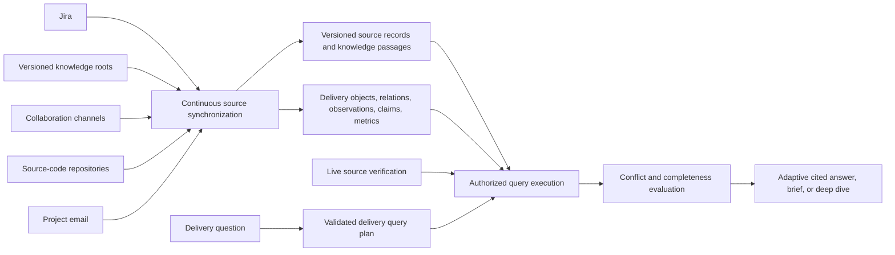

# Feature Specification: AI Delivery Assistant Intelligence

**Feature Branch**: `feat/daily-activity-report`
**Created**: 2026-07-20
**Status**: Approved for implementation
**Parent Specification**: [Teams Mention Production](../002-teams-mention-production/spec.md)
**Execution State**: existing production-pilot child capability

## 1. Purpose

Extend the accepted production pilot into an AI Delivery Assistant that can answer the ordinary operating questions asked of a Delivery Manager or Project Manager. Sarathi organizes connected project data into a reusable delivery model, queries live systems when current authority matters, and returns concise answers with resolvable citations.

The existing knowledge layer remains the supporting document, provenance, search, and deletion-reconciliation capability. It is not the product identity or the owner of delivery-management semantics.

This remains one child capability of the existing production pilot. It does not create another product plan, epic, convoy, deployment, or datastore.

## 2. Problem and Objective

The current production path can retrieve narrow cited context, but it cannot reliably answer questions about scope, ownership, dependency waits, blockers, sprint work, delivered outcomes, capacity, risks, recurring issues, requirements, decisions, or next actions. Semantic passages alone do not provide stable joins, lifecycle state, aggregation, conflict detection, or predictable latency.

The objective is to maintain a policy-bounded delivery representation once and reuse it across delivery questions. A new wording must compile to existing safe query operations rather than require a new adapter, table, or question-specific code path.

## 3. Principles

1. **Delivery concepts organize the system.** Projects, work, people, ownership, dependencies, requirements, risks, decisions, activity, claims, and metrics are first-class.
2. **Time is a dimension, not the architecture.** Occurrence, observation, validity, sprint, and reporting windows qualify delivery records and queries; no temporal aggregate owns the system.
3. **Observation and assertion remain distinct.** A commit, transition, or message is trusted as an event that occurred. Statements inside a source are attributed claims and may conflict.
4. **Connected scope replaces record approval.** Read-only reporting uses every record available through configured project connectors. There is no per-message or per-record approval state.
5. **Workspace and finance boundaries precede content access.** Mapped workspace members may query non-financial project data. Finance is isolated and denied without an explicit confidential audience.
6. **Sources retain authority and provenance.** Jira, configured knowledge roots, source-code repositories, and collaboration channels are continuously synchronized; live reads verify exact current state when required. Derived state never overwrites its source.
7. **Knowledge retrieval supports delivery reasoning.** Versioned documents, passages, full-text search, vectors, citations, and deletion reconciliation enrich structured delivery queries.
8. **Frameworks remain at the edge.** Domain and application code do not depend on Drizzle, PostgreSQL, Graph, Jira, GitHub, Vault, Railway, or model-provider SDK types.
9. **Response depth follows intent.** Operational answers prefer concise, decision-ready formatting, while requested briefs and deep dives may use the length, structure, and latency needed for completeness. Resolvable citations remain inline; a person is tagged only through a source-resolved Teams identity.

## 4. Capability Architecture

`delivery-intelligence` owns the delivery vocabulary, normalized query plan, conflict rules, result model, and concise report composition. `knowledge-layer` owns source items, immutable versions, passages, ACL metadata, embeddings, hybrid retrieval, citations, checkpoints, and deletion reconciliation. `boundary-policy` and identity capabilities authorize the request before either capability retrieves content. Infrastructure adapters translate external APIs and PostgreSQL rows into capability ports.

## 5. User Scenarios and Acceptance

### Story 1 — Project State and Ownership

A mapped workspace member asks about current scope, requirements, milestones, ownership, who is working on what, capacity, or next actions and receives a concise synthesis from the reusable delivery model.

**Independent test**: multiple wordings compile to the same safe query operators and return equivalent cited facts without adding question-specific persistence or adapters.

### Story 2 — Dependencies, Blockers, and Risks

A member asks who is waiting for whom, whether anyone is stuck, or for the top risks. Sarathi traverses relationships, work state, risk records, and recent claims while preserving unresolved disagreements.

**Independent test**: dependency direction, blocked state, risk ordering, workspace exclusion, finance exclusion, and competing claims are asserted with resolvable citations.

### Story 3 — Delivery and Activity Reports

A member asks what the team delivered last sprint, is doing this week, or did today. Sarathi applies the requested sprint or calendar window as a filter over work, observations, and live activity.

**Independent test**: yesterday, today, week, current-sprint, previous-sprint, and quarter questions use the same domain model with different optional boundaries. Fast operational questions return in less than ten seconds; requested deep dives follow an explicit completeness-first response mode.

The response opens by acknowledging the requested reporting scope, uses concise
visual bullets for the material status, and ends with one numbered action. When
the contributing Teams activity contains a Graph-resolved person mention,
Sarathi may preserve that native mention for delegation; it never infers a
mention target from display text alone.

### Story 4 — Recurring Problems

A member asks what keeps going wrong. Sarathi groups repeated issue categories, blocker reasons, failed checks, reopened work, and recurring claims without treating lexical similarity alone as proof.

**Independent test**: a recurring pattern requires multiple distinct occurrences, retains contributing citations, and does not duplicate one event across sources.

### Story 5 — Implementation Questions

A member asks a question that requires repository truth. Sarathi retrieves from the continuously synchronized default-branch code projection, verifies live source state when freshness or exactness requires it, and returns commit-pinned citations.

**Independent test**: the answer contains a resolvable, commit-pinned repository citation; changed files are re-indexed without re-embedding unchanged files; and a stale checkpoint triggers live verification or an explicit freshness warning.

### Story 6 — Continuously Current Project Knowledge

An operator can bootstrap a configured historical window and then rely on source events plus hourly reconciliation to keep Jira, knowledge roots, repositories, and collaboration messages current without full re-indexing.

**Independent test**: create, edit, rename, delete, duplicate-event, missed-event, expired-subscription, and unchanged-replay scenarios converge to the authoritative source state with correct versions, vectors, tombstones, checkpoints, and privacy-safe freshness metrics.

## 6. Functional Requirements

- **FR-001**: Model workspace-scoped delivery objects, relationships, observations, claims, metrics, conflicts, and source links independently of any reporting period.
- **FR-002**: Represent time only through optional occurrence, observation, effective, sprint, milestone, and query-window fields.
- **FR-003**: Compile delivery questions into a validated `DeliveryQueryPlan` composed from whitelisted selectors, relation traversals, predicates, groupings, measures, ordering, limits, source needs, and an optional time boundary.
- **FR-004**: Reject arbitrary database queries and unknown plan operators before executing a source or loading content.
- **FR-005**: Use Drizzle schema definitions and generated, versioned migrations for all new production tables. Do not replace existing audit or knowledge tables.
- **FR-006**: Enable and verify pgvector in the existing PostgreSQL service and retain full-text/vector retrieval for unstructured knowledge.
- **FR-007**: Continuously synchronize the full configured Jira project boundary, including project metadata, fields, hierarchy, board columns, sprint, status, assignee, reporter, priority, components, versions, estimates, time tracking, links, changelog, descriptions, and comments; derive status wait intervals from changelog timestamps.
- **FR-008**: Continuously synchronize configured version-controlled knowledge roots by immutable tree/blob identity, heading, project metadata, edit, rename, deletion, and scope change rather than re-embedding unchanged documents.
- **FR-009**: Bootstrap and continuously synchronize configured collaboration channels without per-record approval. Preserve threads, replies, edits, deletions, authors, mentions, native links, and attachment metadata; exclude assistant prompts, bot replies, tests, finance content, and unauthorized channels before embedding.
- **FR-010**: Bootstrap configured source-code repositories at the current default-branch revision; persist file, symbol, snippet, line-range, commit, pull-request, review, check, release, and deployment projections; apply changed-file delta indexing on verified events; and retain live API/search verification.
- **FR-011**: Treat source-native events as observations; represent statements as attributed claims with subject, predicate, value, source, author, authority, citation, and observation metadata.
- **FR-012**: Preserve simultaneously active conflicting claims and disclose disagreement. Authority and recency may rank claims but must not silently erase conflict.
- **FR-013**: Make non-financial project data visible to mapped workspace members. Store finance metrics and finance-classified content in an isolated confidential boundary that fails closed for general queries.
- **FR-014**: Reconcile edits, deletions, scope removal, and connector changes so stale projections become inactive before retrieval or model egress.
- **FR-015**: Suppress duplicate observations and claims using stable source identity, version, content hashes, and cross-source equivalence keys.
- **FR-016**: Use Vercel AI SDK provider abstractions with OpenRouter as the only production model/embedding provider. Tests use deterministic implementations.
- **FR-017**: Answer deterministic delivery queries without a model when possible. Model-assisted planning or synthesis receives only an authorized, bounded result envelope.
- **FR-018**: Select a declared response-depth mode from the request. Fast operational answers target less than ten seconds and the smallest complete Teams-native shape; structured briefs and explicit deep dives may exceed the fast budget and must preserve requested scope, completeness, citations, conflicts, freshness, and gaps.
- **FR-019**: Provide durable ingestion, reconciliation, query, status, and projection-rebuild CLI operations with counts, checksums, checkpoints, and no private bodies in logs.
- **FR-020**: Emit Teams mention entities only for `<at>` tokens backed by a source-resolved Graph user identifier. Do not invent, guess, or resolve people from display text during answer composition.
- **FR-021**: Prefer authenticated source events for low-latency synchronization and run hourly checkpointed reconciliation for every configured source as the correctness and repair path.
- **FR-022**: Store idempotent event deliveries, subscription lifecycle, leases, cursors, scope hashes, freshness, lag, retries, and safe failure classes without logging source bodies or private scope values.
- **FR-023**: Re-embed only changed passages and prove that unchanged vectors are reused across event, hourly, and manual reconciliation.
- **FR-024**: Keep orchestration framework-neutral. Use the existing typed application workflows and PostgreSQL checkpoints unless measured autonomous workflows satisfy the adoption gate in ADR 0008.

## 7. Core Data Contracts

- **DeliveryObject**: a project, person, team, module, requirement, milestone, sprint, work item, deliverable, risk, decision, or configured extension with stable workspace and source identity.
- **DeliveryRelation**: a typed directed edge such as owns, assigned-to, contains, depends-on, blocks, contributes-to, implements, affects, or supersedes.
- **DeliveryObservation**: an immutable normalized event or state observation from a connected source.
- **DeliveryClaim**: an attributed statement about a subject and predicate; claims may coexist and conflict.
- **DeliveryMetric**: a typed numeric or categorical measurement. Financial kinds are physically and logically isolated.
- **DeliveryConflict**: a derived result over incompatible active claims; it is not an independent source of truth.
- **DeliveryQueryPlan**: an authorized, whitelisted plan over objects, relations, observations, claims, metrics, knowledge, and live backends, optionally constrained by time.
- **DeliveryResult**: cited facts, grouped measures, conflicts, completeness, and unavailable-source metadata suitable for deterministic or model-assisted composition.
- **KnowledgeRecord**: versioned source item, passage, ACL/provenance metadata, search projection, and deletion state supporting unstructured retrieval.
- **SyncCheckpoint**: connector cursor, scope checksum, completion state, counts, and safe failure metadata.

## 8. Operational and Security Standards

- Authorization resolves the installed organization, workspace, mapped actor, maximum sensitivity, connected sources, and finance entitlement before source access.
- Original source audience metadata is retained for provenance. The configured serving policy may project connected non-financial records to the whole workspace; cross-workspace access remains denied.
- Project-email connectors require explicit mailbox, participant, thread, label, or project-identifier routing and must not scan unrelated mail.
- Logs contain identifiers, counts, hashes, timing, checkpoints, and redacted error classes only. They never contain provider keys, message bodies, email bodies, document bodies, or model prompts.
- Checkpoints advance only after the source record, knowledge projection, delivery projection, ACLs, and tombstones commit together.
- Production migration requires a verified backup/restore point and recorded application rollback revision before apply.

## 9. Verification

Permanent tests cover architecture boundaries, generated migration ordering, existing-table preservation, replay deduplication, version changes, deletion and scope removal, object/relation reconciliation, finance isolation, workspace exclusion, connected-source guards, plan validation, dependency traversal, ownership, blockers, current and previous sprint queries, risk ordering, recurring-pattern thresholds, claim conflicts, citation resolution, log redaction, partial-source behavior, model-egress filtering, concise rich-response shape, and source-resolved Teams mention transport.

Final acceptance requires exact-branch `bun run check`, runtime smoke, production backup and rollback evidence, historical bootstrap plus continuous event/hourly reconciliation, and observed real Teams answers for project status, delivery risks/next action, implementation truth, dependencies/blockers, sprint and quarter delivery, current work, recurring issues, and daily/weekly summaries. Fast operational questions must meet the ten-second target; requested deep dives are evaluated for completeness and disclosed elapsed time.

## 10. Non-Goals

- No separate graph or vector database.
- No unbounded repository history, binary/build/dependency indexing, or source scope outside configured repositories and branches.
- No cross-workspace synthesis.
- No autonomous source-system writes or external publication in this capability.
- No unrestricted mailbox or personal-message search.
- No generic SQL or connector query generated by a model.
- No time-centric event-sourcing rewrite of the complete application.

## 11. Rollback and Stop Conditions

Stop on backup failure, migration drift, connector-scope ambiguity, unauthorized source access, finance leakage, missing citation resolution, private-body logging, or real-answer regression. Roll back the application to the recorded Railway revision, stop synchronization, leave additive tables unused, and use the verified PostgreSQL recovery path if database restoration is required. Do not drop or replace existing audit or knowledge tables as part of application rollback.

## 12. References

- [Implementation Plan](./plan.md)
- [Delivery Intelligence Redesign](./delivery-intelligence.md)
- [Continuous Source Synchronization](./continuous-source-synchronization.md)
- [ADR 0006](../../docs/adr/0006-postgres-knowledge-retrieval-stack.md)
- [ADR 0007](../../docs/adr/0007-delivery-intelligence-projection.md)
- [ADR 0008](../../docs/adr/0008-continuous-project-intelligence-synchronization.md)
- [Module Boundaries](../../docs/architecture/module-boundaries.md)
- [Workspace and Capability Model](../../docs/architecture/workspace-capability-model.md)
