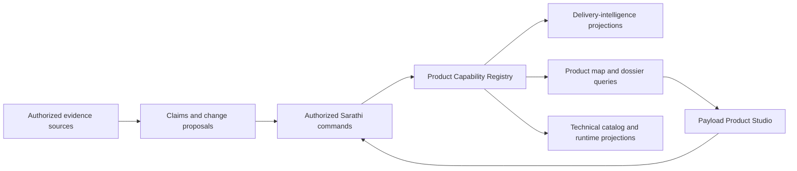

# Specification: Product Capability Registry And Product Studio

## Purpose

Define a Sarathi-owned, business-first model of products, areas, capabilities, and recognizable features. The registry gives delivery questions a stable product vocabulary while allowing product owners to inspect, correct, regroup, merge, split, and retire that vocabulary through a human-facing Product Studio.

This specification is workspace-neutral. Organization names, product taxonomies, client variants, source mappings, reviewers, evaluation vocabulary, and evidence belong in a private deployment overlay or runtime storage.

## Problem And Objective

Delivery evidence arrives as issues, conversations, documents, commits, deployments, telemetry, and QA observations. Those records describe work, but they do not provide a durable product map. A phrase understood by a team can therefore be answered using unrelated recent activity even when the underlying evidence exists.

The objective is to give Sarathi stable product identity and evolution without turning a CMS, Jira, a software catalog, or an embedding index into the authority for product meaning.

## Product Contract

- Sarathi owns canonical product entities, hierarchy, typed relations, variants, registration state, lifecycle, revisions, and identity history.
- The existing `delivery-intelligence` report pipeline remains the reporting product. It consumes registry identities and projections; this work does not create another weekly, sprint, or leadership path.
- Payload CMS may provide the human-facing Sarathi Product Studio. It renders Sarathi query results and submits explicit commands to Sarathi. It never writes Sarathi domain tables directly.
- Source-derived and model-derived interpretations begin as proposals or evidence-backed claims. They do not become ratified product truth automatically.
- Authorization completes before registry queries, evidence expansion, change preview, or command execution.

## Principles

1. **Business language is primary.** Product areas, capabilities, and features are named for what users and the business recognize. Repositories, services, APIs, infrastructure, and telemetry are supporting realization links.
2. **Stable identity survives reorganization.** Renames and moves preserve opaque IDs. Merges create redirects. Splits preserve history and require explicit reassignment or orphaning of existing claims.
3. **One navigation tree, many semantic relations.** Every structural entity has at most one active primary parent, while typed graph edges express dependencies, realization, availability, journeys, variants, evidence, and evolution.
4. **Authority is discrete.** `candidate`, `ratified`, `contested`, and `superseded` describe registration authority. A model confidence score cannot ratify an entity.
5. **Time and variants are first-class.** Historical reports use the product structure valid at that time. Client, tenant, brand, role, environment, version, build, and feature-flag differences do not silently overwrite the base product definition.
6. **Evidence remains attributable and bounded.** Claims retain provenance, observation time, validity, audience, sensitivity, retention, and model-egress constraints.
7. **Views are not semantics.** Node coordinates, zoom, filters, expanded branches, saved layouts, and presentation grouping cannot change domain meaning.

## Conceptual Model

The primary hierarchy contains only durable product concepts:

`product -> product area -> capability -> feature`

The hierarchy may stop at any level when further decomposition is not useful. Requirements, invariants, defects, migrations, customizations, work items, and deployments are linked records, not compulsory hierarchy levels. The leaf is the lowest unit that product and delivery people can consistently recognize, discuss, own, and evaluate.

## User Scenarios

### Product owner reviews the product map

Given an authorized workspace, the Product Studio shows a zoomable primary hierarchy with optional relation overlays. The product owner can open a feature dossier, inspect aliases, variants, evidence, delivery activity, technical realization, availability, and unresolved proposals without reading raw source streams.

### Product owner changes structure

The user previews a rename, move, relation change, merge, split, retirement, or audience change. Sarathi returns the affected paths, linked delivery records, variants, claims, saved views, and policy warnings. The user submits the command against an expected revision. Sarathi either commits the whole governed change and audit event or rejects it without partial mutation.

### Sarathi answers a product question

For a named capability or feature, Sarathi resolves canonical identities and aliases before collecting delivery evidence. Unrelated recent records cannot satisfy the question. A completion answer distinguishes implemented, deployed, verified, accepted, and impact-observed states for the requested variant and environment.

### Sarathi learns tribal knowledge

Authorized conversations, meeting transcripts, checklists, issues, emails, code, deployments, telemetry, and product observations may propose aliases, invariants, relationships, variants, or new entities. High-impact proposals require human ratification. Rejected proposals remain auditable and do not repeatedly reappear without materially new evidence.

## Functional Requirements

- **FR-001**: The registry MUST assign stable opaque IDs independent of names, paths, sources, and UI slugs.
- **FR-002**: The primary hierarchy MUST enforce one active parent per structural entity, workspace isolation, kind compatibility, bounded depth, and cycle prevention.
- **FR-003**: Typed relations MUST express non-hierarchical semantics without converting the primary hierarchy into a multi-parent navigation graph.
- **FR-004**: Renames, moves, merges, splits, retirement, and supersession MUST preserve append-only identity and revision history.
- **FR-005**: A split MUST NOT complete until every active alias, claim, variant, relation, and delivery reference is reassigned, retained on a declared survivor, or explicitly orphaned for review.
- **FR-006**: Base product meaning and scoped variants MUST be separate. Variant resolution MUST be deterministic and explain its applicable client, tenant, brand, role, environment, version, build, and feature-flag qualifiers.
- **FR-007**: Claims and evidence MUST retain distinct sensitivity. A broadly visible claim MUST NOT expose sealed evidence content or a prohibited citation.
- **FR-008**: Every query and command MUST carry workspace, authenticated actor, effective audience, maximum sensitivity, model-egress policy, and permitted corpus scopes.
- **FR-009**: Every mutating command MUST require an idempotency key, expected revision, justification, and actor context, and MUST return the resulting revision and audit event.
- **FR-010**: The command preview MUST use the same validation and authorization rules as commit and MUST disclose impact without leaking unauthorized linked records.
- **FR-011**: Payload drafts, versions, or publishing states MUST NOT equal Sarathi registration or lifecycle states.
- **FR-012**: Product Studio unavailability MUST NOT prevent Teams answers or delivery synchronization.
- **FR-013**: Existing capability-ledger and report consumers MUST migrate additively to registry IDs and MUST retain current report validation, citation resolution, and safe-failure behavior.
- **FR-014**: UI, QA, or runtime exploration MUST produce build-, environment-, tenant-, and anchor-qualified observations. Unbound observations MUST NOT auto-promote to product truth.
- **FR-015**: Coverage queries MUST expose stale, contested, unmapped, weakly evidenced, unavailable, and variant-ambiguous areas without publishing raw evidence inventories.

## Human Review Boundaries

Human ratification is mandatory for:

- creating or deleting a top-level area;
- changing canonical identity or primary boundaries;
- merge, split, redirect, retirement, or supersession;
- changing an invariant, audience, sensitivity ceiling, or variant precedence;
- promoting a candidate inferred only from private or sealed evidence.

Low-risk aliases, descriptive corrections, technical links, and additional evidence may be auto-applied only when workspace policy permits it, the command is reversible, and all invariants pass. AI-generated proposals expire when they remain unreviewed beyond the configured validity window.

## Success Criteria

- A product owner can navigate from a product map to a feature dossier and back without needing database access.
- Rename and move retain entity identity; historical queries reproduce the hierarchy valid at the requested time.
- Merge and split fixtures prove redirect and reference-reassignment behavior.
- A named-feature completion query excludes unrelated work and resolves aliases deterministically.
- A client-specific or environment-specific answer states the exact variant and availability evidence used.
- Unauthorized actors receive no graph, preview, evidence, citation, or model call.
- The existing governed period and leadership reports remain on their current application path.

## Non-Goals

- Replacing PostgreSQL, pgvector, Drizzle, `delivery-intelligence`, `knowledge-layer`, or the report composer.
- Treating Payload, Backstage, Jira, source YAML, embeddings, or an LLM as canonical product truth.
- Building a tenant-wide enterprise catalog or ingesting unapproved personal communications.
- Making every source artifact a product entity.
- Enabling direct source-system writes from Product Studio in the first implementation.
- Choosing a graph-visualization library before interaction, accessibility, and scale tests.

## References

- [Implementation Plan](./plan.md)
- [Data Model](./data-model.md)
- [Query And Command Contract](./contracts/product-model-api.md)
- [Research](./research.md)
- [ADR 0011](../../docs/adr/0011-product-capability-registry-and-product-studio.md)
- [ADR 0007](../../docs/adr/0007-delivery-intelligence-projection.md)
